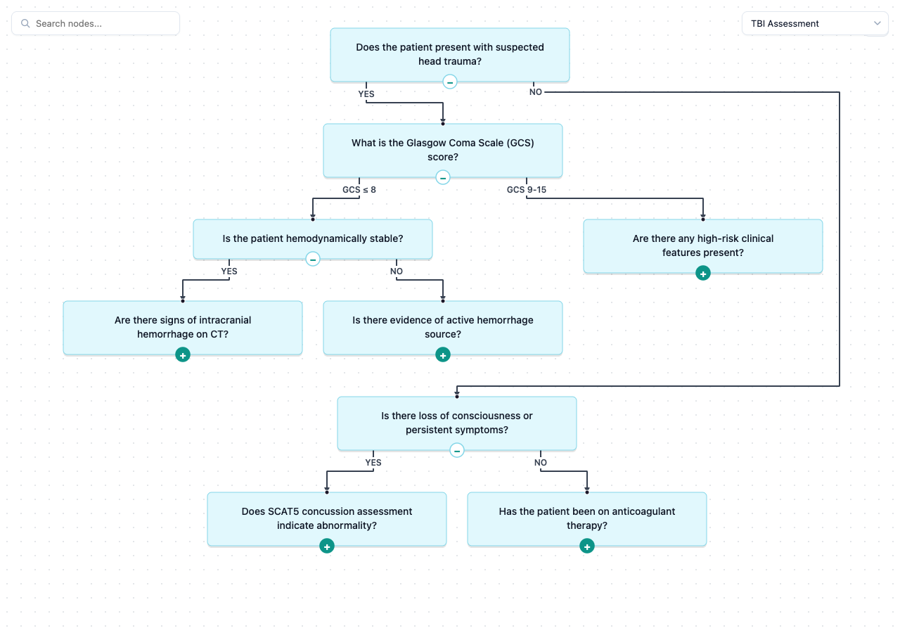

# decision-tree-graph

A React component for visualizing decision trees and directed acyclic graphs. Supports three layout algorithms (compact, hierarchical, force-directed), interactive expand/collapse, search, zoom/pan, and smooth animations.



## Installation

```bash
npm install decision-tree-graph
```

Peer dependencies:

```bash
npm install react react-dom
```

## Quick Start

```tsx
import { DecisionTree } from 'decision-tree-graph';

function App() {
  return (
    <div style={{ width: '100%', height: '100vh' }}>
      <DecisionTree src="/data/my-tree.json" />
    </div>
  );
}
```

The component fills its parent container, so make sure the parent has a defined width and height.

## Data Formats

The `src` prop points to a JSON URL. Two formats are supported:

### Nested Tree

A recursive structure where each node contains its children inline. This is the simplest format for hand-authored trees.

```json
{
  "id": "root",
  "label": "Should we deploy?",
  "type": "decision",
  "children": [
    {
      "id": "tests-pass",
      "label": "Do all tests pass?",
      "type": "decision",
      "edgeLabel": "Yes",
      "children": [
        {
          "id": "deploy",
          "label": "Deploy to production",
          "type": "leaf",
          "edgeLabel": "Yes",
          "data": { "confidence": 0.95 }
        },
        {
          "id": "fix-tests",
          "label": "Fix failing tests first",
          "type": "leaf",
          "edgeLabel": "No"
        }
      ]
    },
    {
      "id": "not-ready",
      "label": "Postpone deployment",
      "type": "leaf",
      "edgeLabel": "No"
    }
  ]
}
```

**Node fields:**

| Field       | Type     | Required | Description                              |
| ----------- | -------- | -------- | ---------------------------------------- |
| `id`        | string   | yes      | Unique identifier                        |
| `label`     | string   | yes      | Display text                             |
| `type`      | string   | no       | `"decision"`, `"leaf"`, or `"chance"`    |
| `children`  | array    | no       | Child nodes (nested recursively)         |
| `edgeLabel` | string   | no       | Label on the edge from the parent        |
| `data`      | object   | no       | Arbitrary metadata (shown in tooltips)   |

### Flat Graph

A nodes + edges array format, useful for programmatically generated graphs or DAGs.

```json
{
  "nodes": [
    { "id": "start", "label": "Start Process", "type": "decision" },
    { "id": "validate", "label": "Validate Input", "type": "decision" },
    { "id": "success", "label": "Success", "type": "leaf" },
    { "id": "error", "label": "Handle Error", "type": "leaf" }
  ],
  "edges": [
    { "source": "start", "target": "validate", "label": "Begin" },
    { "source": "validate", "target": "success", "label": "Valid" },
    { "source": "validate", "target": "error", "label": "Invalid" }
  ],
  "rootId": "start"
}
```

`rootId` is optional — if omitted, the library infers it as the node with no incoming edges.

## API

### `<DecisionTree />`

| Prop        | Type                | Default | Description                              |
| ----------- | ------------------- | ------- | ---------------------------------------- |
| `src`       | `string`            | —       | **Required.** URL to the tree JSON file  |
| `className` | `string`            | —       | CSS class on the container div           |
| `style`     | `React.CSSProperties` | —     | Inline styles on the container div       |

### Exported Types

```ts
import type {
  DecisionTreeProps,
  NodeType,        // 'decision' | 'leaf' | 'chance'
  LayoutMode,      // 'compact' | 'hierarchical' | 'force'
  Direction,       // 'TB' | 'LR'
  GraphNode,
  GraphEdge,
  LayoutConfig,
  GraphData,
} from 'decision-tree-graph';
```

## Examples

### Basic Usage

```tsx
import { DecisionTree } from 'decision-tree-graph';

function BasicExample() {
  return (
    <div style={{ width: 800, height: 600 }}>
      <DecisionTree src="/api/decision-tree" />
    </div>
  );
}
```

### Full-Page Visualization

```tsx
import { DecisionTree } from 'decision-tree-graph';

function FullPage() {
  return (
    <div style={{ position: 'fixed', inset: 0 }}>
      <DecisionTree src="/data/tree.json" />
    </div>
  );
}
```

### Styled with CSS Classes

```tsx
import { DecisionTree } from 'decision-tree-graph';
import './dashboard.css';

function Dashboard() {
  return (
    <div className="dashboard-grid">
      <DecisionTree
        src="/api/risk-assessment"
        className="tree-panel"
        style={{ borderRadius: 8, border: '1px solid #e2e8f0' }}
      />
    </div>
  );
}
```

### Loading from a Dynamic Source

```tsx
import { useState } from 'react';
import { DecisionTree } from 'decision-tree-graph';

function TreeExplorer() {
  const [treeUrl, setTreeUrl] = useState('/data/tree-a.json');

  return (
    <div>
      <nav>
        <button onClick={() => setTreeUrl('/data/tree-a.json')}>Tree A</button>
        <button onClick={() => setTreeUrl('/data/tree-b.json')}>Tree B</button>
        <button onClick={() => setTreeUrl('/data/tree-c.json')}>Tree C</button>
      </nav>
      <div style={{ width: '100%', height: 'calc(100vh - 48px)' }}>
        <DecisionTree src={treeUrl} />
      </div>
    </div>
  );
}
```

### Serving JSON from a Local File (Vite)

Place your JSON in the `public/` directory:

```
public/
  data/
    my-tree.json
```

Then reference it:

```tsx
<DecisionTree src="/data/my-tree.json" />
```

### Serving JSON from a Local File (Next.js)

Place your JSON in the `public/` directory the same way, or serve it from an API route:

```ts
// app/api/tree/route.ts
import { NextResponse } from 'next/server';
import treeData from '@/data/my-tree.json';

export function GET() {
  return NextResponse.json(treeData);
}
```

```tsx
<DecisionTree src="/api/tree" />
```

## Features

- **Three layout algorithms** — Compact tree, Hierarchical (Sugiyama), and Force-directed
- **Interactive expand/collapse** — Click nodes to reveal or hide subtrees
- **Search** — Full-text search with node highlighting
- **Zoom and pan** — D3-powered smooth navigation
- **Minimap** — Overview navigation for large trees
- **Animated transitions** — Smooth layout changes with configurable duration
- **Edge labels** — Display labels on connections between nodes
- **Tooltips** — Hover to see node metadata
- **Fit to view** — One-click to fit the entire graph in the viewport
- **Direction control** — Switch between top-down and left-right layouts
- **Color-coded node types** — Visual distinction between decision, leaf, and chance nodes
- **Responsive** — Adapts to container size with ResizeObserver

## Layout Algorithms

### Compact

The default layout. Recursively positions nodes in a tight tree structure that adapts to container width. Best for smaller to medium trees.

### Hierarchical (Sugiyama)

A layered layout algorithm that minimizes edge crossings. Nodes are organized into layers with automatic spacing. Best for complex trees and DAGs where clarity matters.

### Force-Directed

Uses a D3 force simulation with custom hierarchy constraints. Nodes repel each other while edges pull connected nodes together. Supports interactive node dragging. Best for exploring organic graph structures.

## Development

```bash
# Install dependencies
npm install

# Start dev server
npm run dev

# Build the library
npm run build:lib

# Lint
npm run lint
```

## License

Copyright (c) Avelin Partners

This project is licensed under **AGPL-3.0** for open-source use. See [LICENSE](LICENSE) for details.

### Commercial Use

To use this library in a proprietary or commercial application without the AGPL obligations, you must obtain a commercial license from Avelin Partners. Contact [Avelin Partners](mailto:contact@avelinpartners.com) for licensing inquiries.
